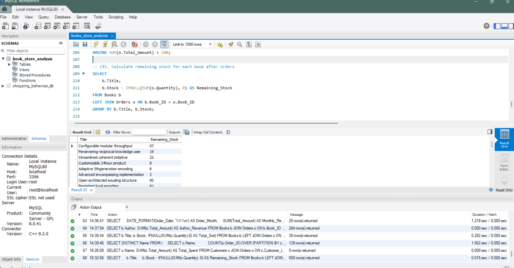
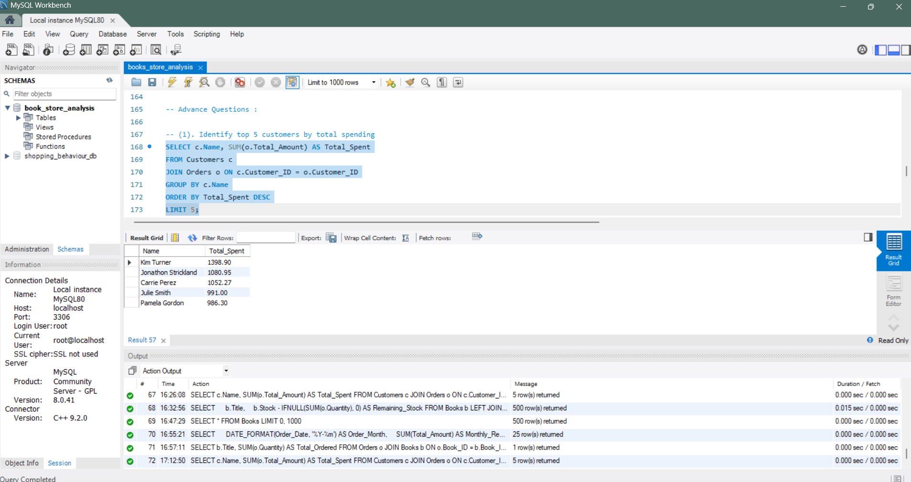

📚 Book Store SQL Analysis
📌 Project Overview

This project is an end-to-end SQL portfolio project built using MySQL, focused on analyzing a fictional Book Store database.
The objective is to demonstrate real-world SQL skills such as database design, data loading, data cleaning, and business-focused analysis using basic to advanced SQL queries.

This project is designed to showcase practical SQL knowledge for Data Analyst / Business Analyst roles.

🗂️ Database Schema

The database consists of three relational tables:

📘 Books

Stores book-level details.

Book_ID (Primary Key)

Title

Author

Genre

Published_Year

Price

Stock

👤 Customers

Stores customer information.

Customer_ID (Primary Key)

Name

Email

Phone

City

Country

🧾 Orders

Stores transactional data.

Order_ID (Primary Key)

Customer_ID (Foreign Key)

Book_ID (Foreign Key)

Order_Date

Quantity

Total_Amount

🔗 Relationships

One customer → multiple orders

One book → multiple orders

🛠️ Tools & Technologies Used

Database: MySQL 8.0

IDE: MySQL Workbench

Language: SQL

Data Source: CSV files

Version Control: Git & GitHub

📥 Data Import & Preparation

Imported CSV files using LOAD DATA INFILE

Configured MySQL secure-file-priv directory

Converted string dates using STR_TO_DATE()

Resolved data length issues using ALTER TABLE

Ensured referential integrity with foreign keys

This simulates a production-style data ingestion workflow.

🔍 SQL Analysis Performed
✅ Basic SQL Queries (15)

View all books and customers

Filter books by price and year

Identify customers by country

Calculate total stock and total revenue

Find minimum and maximum book prices

Analyze order quantities and counts

These queries support exploratory data analysis and validation.

🚀 Advanced SQL Queries (10+)

Top customers by total spending

Revenue analysis by genre and author

Most frequently ordered books

Monthly revenue trends

Remaining inventory after sales

Customers who never placed orders

Inventory shortage risk analysis

Repeat customer identification using window functions

These queries answer real business questions commonly asked in analytics roles.

## 📊 Sample SQL Output Screenshots

### Remaining Stock After Orders

### Monthly Revenue Trend

### Top Customers by Spending

📈 Business Insights

Some key insights derived from the analysis:

A small group of customers contributes a significant portion of total revenue

Certain genres consistently outperform others in both sales volume and revenue

A few books show low remaining stock, indicating potential inventory risk

Monthly revenue trends highlight seasonal demand patterns

Repeat customers generate higher average order values compared to one-time buyers

These insights demonstrate how SQL can support data-driven business decisions.

📁 Repository Structure
Book-Store-SQL-Analysis/
│
├── Data/
│   ├── Books.csv
│   ├── Customers.csv
│   └── Orders.csv
│
├── Screenshots/
│   ├── remaining_stock.png
│   ├── monthly_revenue.png
│   └── top_customers.png
│
├── books_store_analysis.sql   # Complete SQL script (schema + import + queries)
└── README.md

📌 The full SQL logic is intentionally kept in one file for easy execution.

🎯 Key Skills Demonstrated

Relational database design

Primary & foreign key relationships

Data cleaning during import

JOINs (INNER, LEFT)

Aggregations (SUM, AVG, COUNT)

GROUP BY & HAVING

Date handling and formatting

Window functions

Business-oriented SQL problem solving
